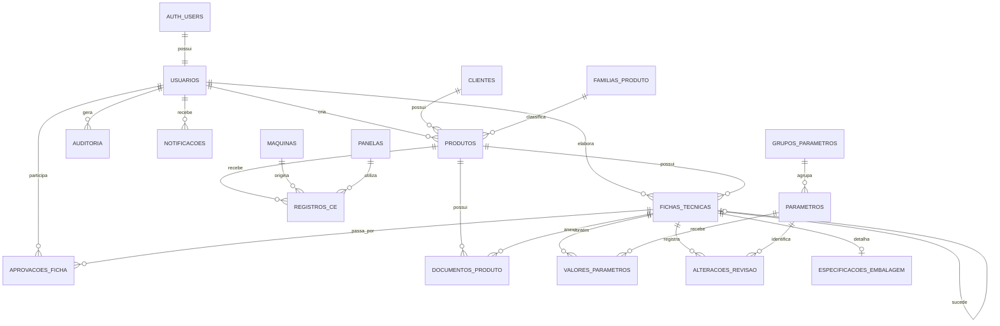

# DER — LIDUTEC+



## Fluxo principal

```text
Cliente
  └── Produto
       ├── Ficha de Moldagem
       ├── Ficha de Fusão/Vazamento
       ├── Ficha de Metalurgia
       ├── Ficha de Embalagem
       ├── Ficha de Qualidade
       ├── Documentos
       └── Registros de CE
```

## Revisões

Cada revisão é uma nova linha em `fichas_tecnicas`.

Exemplo:

```text
MS0013
└── Fusão/Vazamento
    ├── Revisão 54 — OBSOLETA
    ├── Revisão 55 — OBSOLETA
    └── Revisão 56 — APROVADA e VIGENTE
```

A tela principal consulta apenas `vigente = true`.
A tela separada de revisões consulta todas as revisões do produto e do tipo de ficha.
